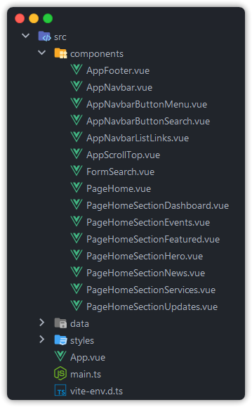

<!-- Heading -->

# South Carolina Revenue and Fiscal Affairs Office Website

A single-page application simulating the South Carolina Revenue and Fiscal Affairs Office website.

- [Demo](#-demo)
- [Features](#-features)
- [Technologies Used](#-technologies-used)
- [Project Configuration](#-project-configuration)
    - [Development Environment](#development-environment)
        - [Tech Stack](#tech-stack)
        - [Styling System](#styling-system)
    - [File Structure](#file-structure)
        - [Assets](#assets)
        - [Components](#components)
        - [Stylesheets](#stylesheets)

<!-- Demo -->

## 🔍 Demo

- Original: [https://rfa.sc.gov/](https://rfa.sc.gov/)
- Re-creation: [https://jamcmich.github.io/portland-webworks-exercise](https://jamcmich.github.io/portland-webworks-exercise/)

<!-- Features -->

## ✨ Features

> Note: The re-created website has identical elements and styling to [the original](https://rfa.sc.gov/) but includes minor stylistic differences and improvements.

- Reusable and scalable styles for buttons, typography, breakpoints, etc.
- Responsive flexbox and grid elements for mobile, tablet, laptop, and desktop compatibility
- Semantic HTML, Aria labels, and tabbable content to encourage accessibility

<!-- Technologies Used -->

## 🧰 Technologies Used

- [Vite.js](https://vitejs.dev/) for more flexible and efficient production and build environments
- [Vue.js single-file components](https://vuejs.org/guide/scaling-up/sfc.html) using the [Options API](https://vuejs.org/guide/introduction.html#api-styles)
- Automated CI/CD build and deployment jobs via [GitHub Actions](https://github.com/features/actions)
- [SASS stylesheets](https://sass-lang.com/) and [BEM class names](https://getbem.com/)
- [ESLint](https://eslint.org/) and [TypeScript](https://www.typescriptlang.org/) integration

<!-- Project Configuration -->

## ⚙️ Project Configuration

### Development Environment

#### Tech Stack

The project is set up via Vite.js and configured with Vue 3, SASS, TypeScript, and ESLint. While TypeScript was unnecessary for the majority of development, I included it in case the project was expanded in the future.

Additionally, I decided to transition from Visual Studio Code to WebStorm for this project and ended up thoroughly enjoying the software, its features, and a refreshing developer experience. There were many scenarios where WebStorm made it simple and easy to refactor my entire project, manage npm installations, or setup Vue and ESLint integrations automatically. Needless to say, it's my go-to IDE now and I encourage other developers to give it a try!

#### Styling System

My approach to building responsive websites leverages flexbox and grid layouts. While some developers prefer to use Tailwind, Bootstrap, or Vuetify to cover all of their styling necessities, I decided SASS would be a more suitable, lightweight solution for building a single-page application.

I utilized [BEM methodologies](https://getbem.com/) in tandem with SASS to create an organized, nested class structure. Many of the sections, typography, layouts, buttons, and other components on the SCRFAO website follow a consistent design pattern which I referenced to create my own system of global variables, mixins, placeholders, and styles.

For iconography, I researched and tested a variety of popular icon solutions to use with Vue and eventually settled with [Iconify](https://icon-sets.iconify.design/). I was impressed with how seamless the library integrated into my existing project and its included support for a variety of frameworks, customization options, and open source tools. Material icons were used throughout the page for consistency and I sourced the custom assets (logos, images, etc.)
directly from the SCRFAO website.

### File Structure

#### Assets

By convention Vue assets are served from the `public` folder and all paths are statically replaced in Vite's build script. From the Vite documentation:

> ... [assets] will be served at root path `/` during dev, and copied to the root of the dist directory as-is... You should always reference `public` assets using root absolute path - for example, `public/icon.png` should be referenced in source code as `/icon.png`.

With this behavior in mind, I've created the below file structure to quickly reference and serve static assets. Although the `icons` folder contains a few custom-made icons (i.e. logo, favicon), the Material icons (i.e. magnifying glass, hamburger menu, etc.) are served from Iconify's library.

#### Components

Vue components are organized in a flat hierarchy within the project's `src` folder. This is a straightforward solution to using single-file components while adhering to the following conventions:

- PascalCase to aid autocompletion features within code editors and stay consistent with JS(X) templates
- Filename prefixes (i.e. `Base`, `App`) to denote app-wide reusable components and group them within the project folder
- Multi-worded component names to avoid Vue element compilation (i.e. a `Table` component would become misconstrued with the HTML `table` tag)

Below is an example of the project's **component** structure:

#### Stylesheets

Even though this was a small scale project, I followed conventional methods for organizing SASS stylesheets as partials to future-proof the project and keep its file structure maintainable. Partials enable developers to split styles across different components and compile SASS more efficiently. The end result is partitioned code that remains lightweight and flexible.

As shown in the example below, each partial is individually imported into its respective component...

...and forms the resulting **stylesheet** structure:

You might notice the `global` folder which serves to organize reusable styles utilized across multiple components. These stylesheets are imported into the `global.scss` file and passed as preprocessed options via Vite's configuration file. This setup allows SASS methods to be used without needing to import them individually and ensures intellisense is available when writing code.

<!-- Development Process -->

### 🛠️ Development Process